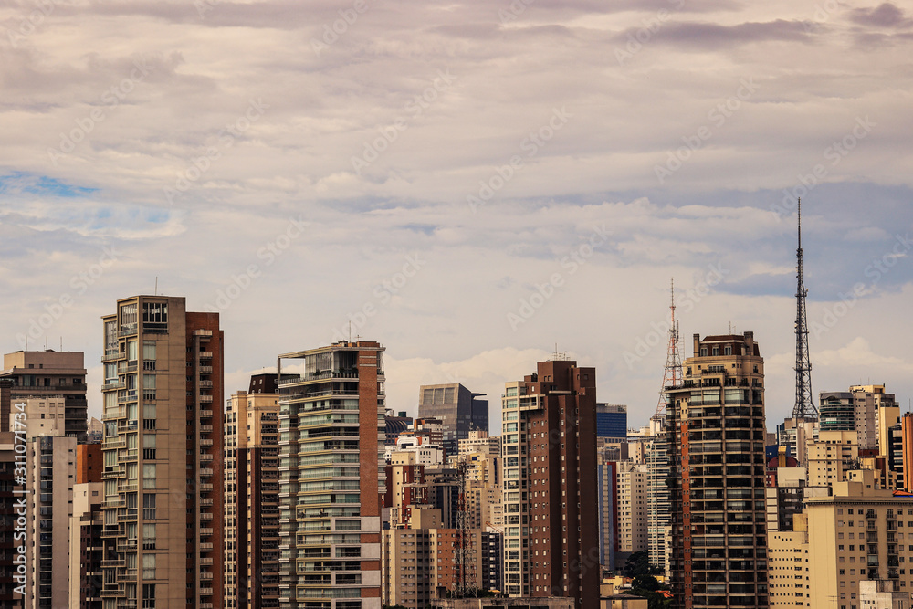

<h1>Problema Skyline</h1>
<h4>Este é minha implementação de um algoritmo para solucionar o skyline problem.</h4>
<p>"Skyline" é o contorno da silhueta formada por todos os prédios de uma cidade vistos de
uma longa distância.</p>


<p>Considerando todos os prédios sendo retangulos, que podem ser descritos pelas coordenadas x1, x2 e y, na qual representa o início, fim e altura, respectivamente, é possível calcular todos pontos da skyline, como feito abaixo:</p>


<p>Perceba, para descrever a skyline são necessários somente os pontos em que ocorre uma mudança na altura, em relação ao ponto anterior. Então para a figura acima, teríamos:</p>

```
//entrada
predios = {
    {2,9,10},    // azul
    {3,7,15},    // vermelho
    {5,12,12},   // verde
    {15,20,10},  // rosa
    {19,24,8},   // amarelo
}

//saida
(2,10)
(3,15)
(7,12)
(12,0)
(20,8)
(24,0)
```
